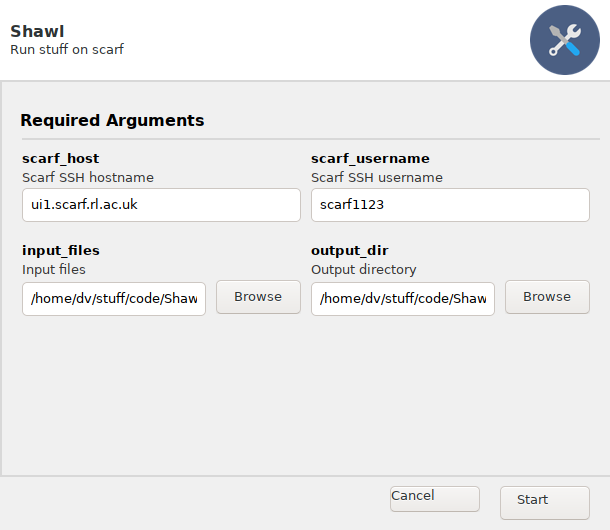

# Shawl

Shawl is a GUI utility to run slurm runs on scarf

## Installation

    git clone https://github.com/dvolk/Shawl
    cd Shawl
    pip3 install -r requirements.txt

## Running

    python3 Shawl.py

## Install dependencides on centos 7

    sudo pip3 install setuptools-rust
    sudo pip3 install --upgrade pip
    sudo yum group install "Development Tools"
    sudo yum install gtk2-devel.x86_64 gtk3-devel.x86_64
    sudo yum install wxGTK
    sudo yum install wxGTK-devel.x86_64
    pip3 install -r requirements.txt
